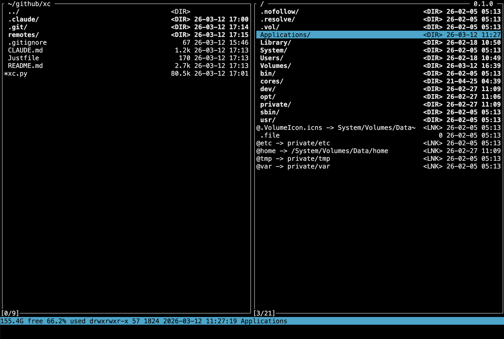

# xc

A two-panel console file manager inspired by Midnight Commander, written in Python.



## Intro

The Python version of xc is a single self-contained script (`xc.py`) that runs via [uv](https://docs.astral.sh/uv/). This means:

- **Zero setup** -- no virtualenv, no `pip install`, no `requirements.txt`. Just run `uv run xc.py`.
- **Inline dependencies** -- the script header declares its own dependencies (`boto3`, `google-cloud-storage`), and uv resolves and caches them automatically on the first run.
- **Reproducible** -- uv pins the Python version (`>=3.11`) and handles isolation, so the script works the same way on any machine.
- **Single file to deploy** -- copy `xc.py` to a server, a dotfiles repo, or a USB stick. There is nothing else to carry.

### Installing uv

```sh
# macOS / Linux
curl -LsSf https://astral.sh/uv/install.sh | sh

# Homebrew
brew install uv

# Windows
powershell -ExecutionPolicy ByPass -c "irm https://astral.sh/uv/install.ps1 | iex"
```

After installing, run the file manager with:

```sh
uv run xc.py
```

The script has a shebang line, so you can rename it, make it executable, and put it on your PATH:

```sh
cp xc.py ~/.local/bin/xc
chmod +x ~/.local/bin/xc
xc
```

### Development

The `pyproject.toml` in the repository is only used for local development tooling (e.g. `black` formatter settings). It is **not** needed to run xc -- `xc.py` is fully self-contained with its own inline dependency declarations.

### Self-update

To update xc to the latest version from GitHub:

```sh
xc -u
```

This fetches the latest `xc.py` from the repository, compares versions, and replaces the current binary if a newer version is available. The previous version is saved as `xc.prev` next to the executable.

## User manual

### Dual-panel concept

xc shows two file panels side by side. One panel is **active** (highlighted border), the other is **inactive**. You navigate files in the active panel and use the inactive panel as a target for file operations like copy and move. Press `Tab` to switch the active panel. Press `h` / `l` to activate the left / right panel directly.

On startup the active panel opens in the current working directory. The inactive panel restores the path from the previous session.

### Navigation

| Key                  | Action                                 |
| -------------------- | -------------------------------------- |
| `Up` / `k`           | Move cursor up                         |
| `Down` / `j`         | Move cursor down                       |
| `Enter`              | Enter directory or open VFS            |
| `Backspace`          | Go to parent directory (or exit VFS)   |
| `Left` / `Right`     | Page up / page down                    |
| `PgUp` / `PgDn`      | Page up / page down                    |
| `Home` / `^`         | Jump to first file                     |
| `End` / `G`          | Jump to last file                      |
| `Ctrl-D` / `Ctrl-U`  | Half-page down / up                    |
| `Ctrl-L`             | Reload current directory               |
| `Tab`                | Switch active panel                    |
| `h` / `l`            | Activate left / right panel            |
| `q`                  | Quit                                   |

### File operations (`x`)

Press `x` to open the **command** menu:

| Key | Action                                                              |
| --- | ------------------------------------------------------------------- |
| `c` | **Copy** -- copy file or tagged files from active to inactive panel |
| `m` | **Move** -- move (rename) file or tagged files                      |
| `d` | **Delete** -- delete file or tagged files                           |
| `k` | **Mkdir** -- create a new directory                                 |
| `t` | **Touch** -- create an empty file                                   |
| `p` | **Chmod** -- change file permissions                                |
| `r` | **Rename** -- rename the selected file                              |
| `g` | **Chdir** -- type a path to navigate to                             |

Copy and move operations use the inactive panel's current path as the default destination. A prompt lets you edit the destination before confirming.

### Tagging and group operations

Press `Space` on a file to **tag** it (marked with `+`). Tagged files are used as the source for copy, move, delete, and chmod. If nothing is tagged, the operation applies to the file under the cursor.

| Key     | Action                                              |
| ------- | --------------------------------------------------- |
| `Space` | Toggle tag on current file and move down            |
| `+`     | Tag all files in current directory                  |
| `_`     | Untag all                                           |
| `i`     | Calculate sizes of tagged (or selected) directories |

### Bookmarks (`b`)

Press `b` to open the **bookmark** menu for quick jumps to common directories (home, desktop, downloads, etc.).

### Editor (`e`) and view (`v`)

Press `e` to open a file in an editor, or `v` to view it. These menus launch external commands with the current file path substituted via macros (see below). On remote VFS (SSH, S3, GCS), the file is automatically downloaded to a temp location, opened locally, and uploaded back if modified.

### Running shell commands

There are two command-line modes:

| Key | Mode       | Behavior                                       |
| --- | ---------- | ---------------------------------------------- |
| `;` | **Direct** | Run a command interactively in the terminal    |
| `:` | **Piped**  | Run a command; output is piped through `less`  |

Both modes support macro expansion. The command runs in the active panel's current directory. If the command exits with a non-zero code, the error is shown in the bottom line.

### Alternate screen and command output

xc runs on the terminal's **alternate screen** -- the panels never mix with your shell's scroll buffer. When you run a shell command (`;` or `:`), xc temporarily switches back to the **main screen** so the command's output is preserved in the normal scroll buffer.

To review previous command output without running anything:

| Key              | Action                          |
| ---------------- | ------------------------------- |
| `Esc` `Esc`      | Switch to main screen           |
| `Ctrl-O`         | Switch to main screen           |
| `Esc` or `Ctrl-O` | Return to panels (main screen) |

Once on the main screen you can scroll through your terminal's history as usual. Press `Esc` or `Ctrl-O` to return to the file panels.

### Search (`/`)

Press `/` to start an incremental search. Type characters to filter -- the cursor jumps to the first matching file. Press `Enter` to accept or `Esc` to cancel.

### Customizing menus

xc is a single Python script. Menus and keymaps are defined at the bottom of the file as plain data -- just edit them to add your own editors, bookmarks, or commands:

```python
app.add_menu("editor", [
    MenuItem("v", "vi", lambda: app.action_run("vi %F")),
    MenuItem("c", "code", lambda: app.action_run("code %F")),
])
```

There is no config file on purpose. The script **is** the config.

### Virtual filesystems

Entering certain files opens them as virtual directories:

| Extension                              | VFS | Description                         |
| -------------------------------------- | --- | ----------------------------------- |
| `.tar`, `.tar.gz`, `.tgz`, `.tar.bz2`  | TAR | Browse tar archives                 |
| `.s3`                                  | S3  | Browse Amazon S3 buckets            |
| `.gcs`                                 | GCS | Browse Google Cloud Storage buckets |
| `.ssh`                                 | SSH | Browse remote servers over SSH      |

VFS config files (`.s3`, `.gcs`, `.ssh`) are simple `key=value` text files. The path header shows the VFS type, e.g. `~/servers/prod.ssh (SSH)`.

**S3 example** (`production.s3`):

```text
type=s3
bucket=my-data-bucket
AWS_ACCESS_KEY_ID=AKIA...
AWS_SECRET_ACCESS_KEY=...
AWS_REGION=eu-west-1
```

If credentials are omitted, the default AWS credential chain is used.

**GCS example** (`analytics.gcs`):

```text
type=gcs
bucket=my-analytics-bucket
key=service-account.json
```

The `key` path can be relative (resolved from the config file's directory) or absolute. If omitted, application default credentials are used.

**SSH example** (`prod.ssh`):

```text
kind=ssh
host=prod-server
user=deploy
identity=~/.ssh/id_ed25519
port=22
```

Only `host` is required. All other fields are optional -- SSH will pick them up from `~/.ssh/config`. The `host` value can be an SSH config alias.

### Remote file editing

The `%F` macro works transparently on remote VFS (SSH, S3, GCS). When you run a command like `vi %F` on a remote file, xc automatically:

1. Downloads the file to a local temp location
2. Runs the command against the local copy
3. If the command exits successfully and the file was modified, uploads it back

This means editors, viewers, and any shell command work on remote files the same way as local ones.

## Macros

Editor, view, and shell command modes (`;` and `:`) all support macro expansion. Macros are prefixed with `%` and let you refer to the current file, directory, or tagged selection in your commands.

| Macro | Description                                            |
| ----- | ------------------------------------------------------ |
| `%f`  | Current file name                                      |
| `%F`  | Current file full path                                 |
| `%x`  | Current file name without extension                    |
| `%X`  | Current file full path without extension               |
| `%d`  | Current directory name                                 |
| `%D`  | Current directory full path                            |
| `%m`  | Tagged file names (space-separated, shell-quoted)      |
| `%M`  | Tagged file full paths (space-separated, shell-quoted) |
| `%&`  | Run command in the background (no terminal output)     |

### Quoting

All macros are automatically shell-quoted. To disable quoting, prefix the macro letter with `~`:

| Macro  | Description                 |
| ------ | --------------------------- |
| `%~f`  | File name, unquoted         |
| `%~F`  | File path, unquoted         |
| `%~m`  | Tagged file names, unquoted |
| `%~M`  | Tagged file paths, unquoted |

### Examples

```text
vi %F          →  vi '/home/user/hello world.txt'
less %F        →  less '/home/user/notes.md'
tar czf %x.tar.gz %~f  →  tar czf 'mydir.tar.gz' mydir
echo %m        →  echo 'file1.txt' 'file2.txt'
cp %M /tmp %&  →  cp '/home/user/a.txt' '/home/user/b.txt' /tmp  (background)
```
